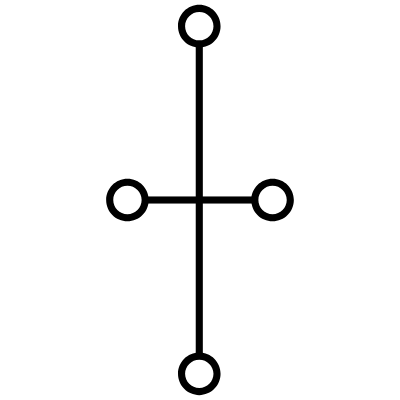
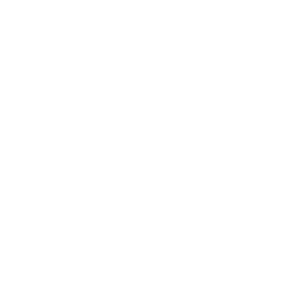

```markdown
# Skia current regression images

## module_1
API-rendered: 
Native Skia: _missing_
Diff: _missing_

## module_2
API-rendered: 
Native Skia: 
Diff: 

## module_3
API-rendered: 
Native Skia: _missing_
Diff: _missing_

## module_4
API-rendered: 
Native Skia: _missing_
Diff: _missing_

## module_5
API-rendered: 
Native Skia: 
Diff: 

## module_6
API-rendered: 
Native Skia: 
Diff: 

## module_7
API-rendered: 
Native Skia: _missing_
Diff: _missing_

```
